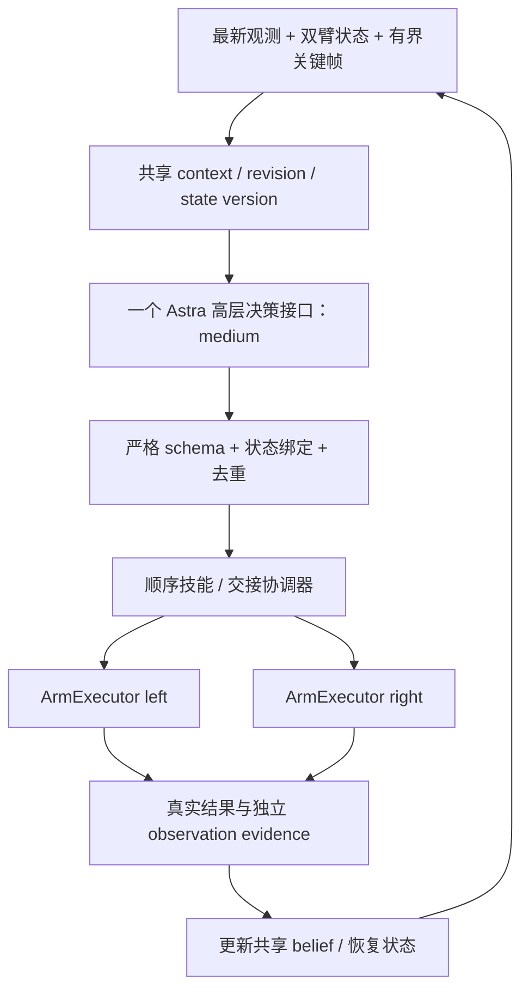

# 双臂分类 demo：离线实验地基

本交付基于 `39a043e4b29ec7e18b1c1f057ebce2aa59a831b2`，分支 `codex/bimanual-sort-foundation-20261007`。最新任务是**左臂拾取 → 双臂交接 → 右臂分类投放**，水果进盘、杂物进盒。完整需求保存在 `BIMANUAL_SORT_TASK_20261007.txt`；不叠加之前“右臂持盒”的草案。

这是可运行的 synthetic foundation，**不是已经完成现场验证的双臂控制器**。当前模型和真实硬件调用均为 0；fixture 的成功只证明状态机及接口工作，不证明视觉识别、接触、抓取或碰撞安全。旧 H/D、legacy、GUI、归档、单臂入口文件没有修改。

## 第一次运行

在 Mac：

```bash
cd /Users/tangchao/Desktop/资料/P7/astra-bimanual-sort-20261007/astra_realman_harness
./launch/bimanual_synthetic.sh --scenario all
```

在工作站独立交付目录（部署后）：

```bash
cd /home/tongji/alex/astra_bimanual_sort_20261007/astra_realman_harness
./launch/bimanual_synthetic.sh --scenario all
```

wrapper 在工作站使用 `/home/tongji/miniconda3/envs/dp/bin/python -I -B scripts/run_bimanual_synthetic.py --scenario all`；其它机器使用 `python3 -I -B`。不需要相机、SDK、SSH bridge 或登录模型；没有 `--execute` 参数，不能通过改一个开关启动真机。

`nominal`、`handoff-failure`、`unknown-ack` 可分别选择。默认 all。Ctrl-C 阻止发出下一条 synthetic command；不操作现场设备。

## 数据流与职责



本批用明确标注 `SCRIPTED_SYNTHETIC_NOT_ASTRA` 的脚本动作代替图中的 Astra，用 MockArmExecutor 和 SyntheticObserver 代替硬件/视觉。`DisabledAstraBackend` 阻止真实模型请求。模型字段固定 `gpt-6-astra` / medium，仅为未来配置，不是一次成功请求的声明。

Astra 未来负责选物、分类、选择高层技能。技能层负责已验证局部 waypoint 和顺序 handshake，日志明确归为 `SKILL_INTERNAL_ACTION`。Codex 本轮是实现者，不作为第二个在线任务 policy。`DELTA_CORRECTION` 保留原数值和显式 arm/frame，限于可用技能阶段；不乘倍数、不设置 minimum step。

## 文件与契约

| 文件 | 职责 |
|---|---|
| `schema/bimanual_high_level.schema.json`、`bimanual_demo/protocol.py` | JSON schema 与严格运行时 parser；独立于旧低层 action schema |
| `state.py` | object identity、class、holder、holder_valid、stage、destination、evidence、版本、fault |
| `skills.py` | left_pick/present、right_receive、handoff、right_place、verify、recover |
| `runtime.py` | 单决策串行协调、另一侧 hold、命令 journal、STOP、版本失效 |
| `executors.py` | 通用两臂接口；仅 mock 实现；真实入口禁用 |
| `evidence.py` | 当前图、六种关键帧槽、时间/hash/revision、synthetic 事件 oracle |
| `logging.py` | 原始提案、内部技能、mock 命令、反馈、耗时、不可混淆的来源标签和快照 |
| `gui_contract.py` | 只读 GUI 扩展字段，不改旧 UI 或旧归档格式 |
| `config/bimanual_synthetic.json` | 显式 synthetic 数值，不可复制为现场坐标 |
| `config/bimanual_field_template.json` | 现场待核验模板；未知坐标、TCP、变换、路径检查均 null |
| `scripts/run_bimanual_synthetic.py`、`launch/bimanual_synthetic.sh` | 可运行离线场景入口 |
| `tests/test_bimanual_foundation.py` | 离线契约、失败和归档测试 |

高层 action 全部显式包含 schema_version、operation_id、state_version、revision(camera/layout/calibration)、action、object_id、semantic_class、destination、arm_id、frame、translation_m、rotation_rpy_rad、intent。非 delta 动作的 arm/frame 为 null、两个 delta 向量为零；SELECT_OBJECT 绑定 fruit→plate / clutter→box；RIGHT_PLACE 指定目标并与共享状态核对。intent 是可展示的简短意图，不是隐藏推理。

## 交接与失败

`LEFT_HOLDING → LEFT_AT_HANDOFF → RIGHT_APPROACH → RIGHT_GRIP → RIGHT_HOLDING_CONFIRMED → LEFT_RELEASE → LEFT_RETRACT → RIGHT_OWNS_OBJECT`。

- SDK/mock ACK 只记录命令结果。夹持、释放、离开交接区、放置成功分别需要绑定 object/operation/state version/observation/revision 的独立证据。
- 右臂未确认持有之前，左夹爪**任何增大 opening** 都被拦截，不只是 fully open。
- LEFT_RETRACT 表示退出命令阶段；只有后续 LEFT_CLEAR 观测才允许右臂运输。
- 任一步失败进入 RECOVER；holder 保留最后已知值但 holder_valid=false。新证据可以推翻旧 belief。
- RECOVER 自身只读取显式证据并恢复一个已确认 checkpoint，不松爪、不移动、不自动重试。继续技能必须是新的 operation_id。
- 未知 ACK 记录 uncertain_dispatch，保持失败；不能推断命令未发送。synthetic unknown-ack 场景由独立 oracle 明确确认左臂仍持物、右臂处于可重新进入接取的 checkpoint 后，脚本再给一个新决策。
- TaskLock 和 operation_id/dispatch journal 提供进程内串行与重复发出保护；**本版不是跨崩溃恢复执行器**，重启不自动恢复现场动作。

## 观测和 history

每张图带 camera_id、timestamp、observation_id、SHA256、source。关键帧额外带 object_id、reason_selected、operation_id、revision；旧图显式 kind=history。保留前后动作、物体/目标清晰视图、交接前后视图六种槽。

默认附件预算四张：保留全部 current views，不挤掉当前图来放历史；少于四张当前图时，接口可选带一张历史图。其余关键帧仅提供引用；后续接真实 backend 时再验证附件预算。相机/桌面布局/标定 revision 更新会清空记忆、使旧 waypoint 无效并进入 RECOVER。不得把桌面相机调整前的目标或标定当成仍有效。

SyntheticObserver 生成 1px PNG 和显式脚本事件，不做真实视觉判断。`SORT_CONFIRMED` 依据 fixture 分类 oracle，不以 SDK 返回或 action 声称的目的地自证成功。

## 日志与最小 GUI 接口

每次写入 `logs/bimanual-synthetic-<time>-<id>/<scenario>/`：

- `events.jsonl`：MODEL_CONTEXT_PREPARED、ASTRA_DECISION（标注脚本来源）、SKILL_INTERNAL_ACTION、RAW_HARDWARE_COMMAND（MOCK/hardware_calls=0）、MEASURED_FEEDBACK、OWNERSHIP_EVIDENCE、SKILL_RESULT、FAULT/RECOVERY。
- `observations/<id>/`：四张 synthetic 图片和 observation.json；不是现场摄像头图像。
- `dispatch-*.json`：发出意图 journal；不是成功回执。
- `summary.json`：每 object 的 calls/time、arm/camera/gripper/handoff/recovery 时间和成功事件；Astra 实际 calls=0，synthetic_decisions 单独计数。
- `gui_state.json`：ACTIVE OBJECT、CLASS、DESTINATION、HOLDER/valid、PHASE、LEFT/RIGHT STATUS、HANDOFF、ASTRA CALL COUNT、OBJECT ELAPSED TIME。
- `manifest.json` + `capture_snapshot.zip`：相对文件列表和 SHA256。图片引用保留原运行绝对路径，迁移归档后按 observation id 和相对 observations 路径解析；本版未接入旧 GUI 的归档浏览器。

耗时仅为 mock 运行时间，不代表真机吞吐。handoff/recovery 与内部 arm/gripper 时间有嵌套，不能直接相加。快照来源为 SYNTHETIC_ONLY、审核状态 UNREVIEWED；不覆写已有实验归档。

## 现场核验清单（集中一次整理，未确认项不填猜值）

| 项目 | 已有线索 / 下一步需核验 |
|---|---|
| 左右身份与网络 | 仓库线索 left 192.168.1.19:8080、right 192.168.1.18:8080；分别现场核对物理臂、型号/自由度、配置和 handle 对应，保存证据 |
| SDK 会话生命周期 | 现有 `api2_readonly.py` 共用 SDK 初始化/连接管理可作为参考；两臂不能各自销毁仍在使用的全局 SDK |
| arm/gripper driver | 复用候选 `/home/tongji/aloha/RealMan_Control/realman_arm.py`、`config/rm_left_arm.yaml` 和 `rm_right_arm.yaml`；左右初始化副作用、映射、反馈、限位需分别验证 |
| opening 语义 | 目标开合度 0闭/1开，不是力控；右夹爪的真实 0–1000 映射、回读、异常和对象保持证据需核实 |
| work/tool/TCP | 双臂各自读取 work/tool 名称、位姿、payload/TCP、单位；同名 World 不能当成同一个世界系 |
| 两臂坐标关系 | cross_arm_transform/shared world 目前 UNKNOWN/null；需可靠变换及来源/版本，或分别验证的配对示教位姿，不凭空填矩阵 |
| source/handoff/destination | source 左臂可达且右臂不直接操作；固定交接位、plate/box 区域、approach/release/retract 与物体姿态范围须现场示教确认 |
| 路径/碰撞 | 现有 endpoint IK 不证明路径和双臂碰撞安全；需列出实际可用全路径检查器、夹爪/物体几何、另一臂 hold 情况，缺失则明确未验证 |
| 速度/负载/停止 | 每臂速度、加速度、负载、软硬限位、持物停止方式与现场急停需验证；不把单臂历史任意动作视为双臂能力证据 |
| 视觉布局与证据 | 本次相机角色/serial/同步、遮挡、分类/夹持/松脱/稳定放置的观测依据；桌面相机调整后换 revision，失效旧目标和记忆 |
| 并发占用 | 迁移时旧真机 loop 停止；现场 runtime 需要同一个机器人级互斥锁。synthetic 锁仅隔离离线实验，不声称能锁住旧进程 |

本地已存在的左右配置及 driver 是复用候选，不等于右臂和双臂交接已经现场验证。有限目录清查未得到可直接沿用的已确认 common-world/handoff 标定；不推断整台工作站不存在这类资料。

## 从单臂基线迁移

1. 保留 39a043e 和当前正在运行的目录；先在独立目录跑本离线入口和测试。
2. 现场核验上表并填写 field template，所有数据带时间、frame、revision 和证据；不启用 synthetic waypoint。
3. 单独实现并测试真实 ArmExecutor 与共享 SDK 生命周期、真实 observer/evidence validator、whole-path 检查和共同任务锁。保持默认 OFF。
4. 将同一个官方 Astra backend 接到新的高层 context/schema，固定 medium；先 shadow 检查真实输入/输出。旧低层 schema 不强行混用。
5. 新真机动作只由操作者现场显式启动。先逐技能核验，再交接 invariant，最后水果/杂物连续分类。没有持物证据不能推进所有权。
6. 通过 GUI 扩展接口接入高层 object/phase/两臂状态和 evidence；保留旧 H/D、legacy、归档入口作为独立模式。

本批没有自动开始第 2–6 步，也没有宣称完整双臂真机 V1 已完成。
