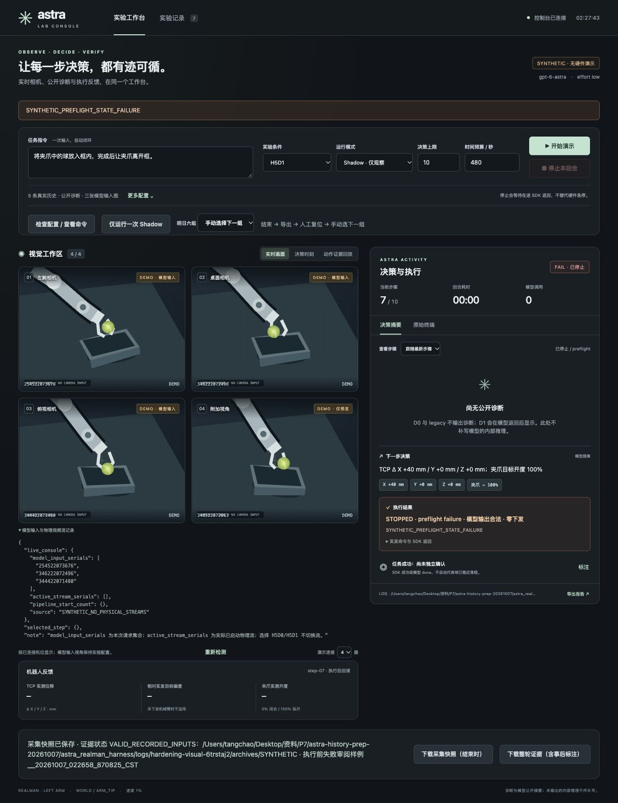

# Evidence / statistics hardening — 2026-10-07

审查基线：`3e59e85361f5129588c18b25d39d100ebc6d5c1c`。本轮只修改证据资格、统计、只读导出、流遥测和停止/退出码呈现。独立提交，不推送、不部署；交付后等待复审。

未修改模型策略、任务文本、四种 H/D 定义、动作解析、IK 或执行器；未加自动重试，未接通 3+1 live。没有真实模型、相机或机器人调用。测试中的 backend pipeline 使用替身 HTTP transport，SDK 与相机也全部由替身提供。

## R1–R5：旧复现 → 新结果

旧结果来自所提供的 `ASTRA_REVIEW_3e59e85_20261007.md` 与审查包中的 reproduction_results；新结果由正式回归测试验证。

| 项目 | 旧复现 | 新结果 / 验证 |
|---|---|---|
| R1 | 同 phase/profile 的 Shadow、Execute 合成元数据落入一个 `real/placement/H5D1` 组，episodes=2 | 分组键为 `model_source/camera_source/mode/phase/profile`。仅有原审查两条元数据时来源仍是 unknown，分别进入 shadow、execute 两组，绝不推定真实来源。6 种案例进入 5 组：Execute 成功与 Execute IK 零下发同组（2 局，1 独立成功、1 unknown），Shadow、fixture、synthetic、未知模式各自隔离。重复路径/episode 排除计数并输出 duplicates.json。 |
| R2 | hash 不符时归档 SAVED，白图仍是普通模型输入图；回放却判 invalid | 统一图片资格校验；保留 expected_hash / actual_hash / integrity_status。正确、缺图、换图、尺寸冲突、transition/附件引用冲突分别验证。无效图不进入 input_images；进入 invalid_input_images，并在 HTML 显示 INVALID，保留损坏 PNG 的调查链接。GUI 决策图片接口、回放同样拒绝。SAVED 只说明写盘完成；evidence_status 单列有效、无效、无输入图。 |
| R3 | 结束后再标注/标记，整轮快照仍缺新标注 | 保留原快照，新增独立 reviewed ZIP：capture/ 原字节 + review/ 最新标签、事件、关键标记 + review_manifest.json 版本、观察者、时间、episode 关联、哈希。标注更改会改变 review_version；原快照、model_input 和 transition 字节不变。HTTP 完整流程和异地解包校验通过；关联错误标为无效，快照被篡改则拒绝导出。 |
| R4 | token_usage 与 api_key 都变成 REDACTED | access_token / api_key / authorization 等仍遮盖；input_tokens=100、output_tokens=20 与合法嵌套统计保留。统计字段只接收非负整数，字符串/布尔值不能伪装统计。步骤 ZIP、准备输入 ZIP、采集归档均覆盖。 |
| R5 | 步骤 ZIP 遗漏原 CLI 的 source_manifest/config | 受控加入 source_manifest.json、config.json、action_schema.json，以及安全拒绝、输入/回读验证、SDK、failure 等本步证据。GUI、wrapper、直接 H/D CLI 日志样式的版本、参数、schema 验证通过；逐字段脱敏、逐文件 SHA256，无整个 config 目录或 token 文件。缺失版本不伪造。 |

实现入口：`scripts/report_history_experiment.py`、`replay_evidence.py`、`episode_archive.py`、`reviewed_export.py`、`evidence_redaction.py`、`astra_gui.py`。正式复现回归在 `tests/test_evidence_hardening.py`；GUI HTTP 与真实 runner 调用链的替身回归分别在 `tests/test_astra_gui.py`、`tests/test_history_diagnostics.py`。

## A / B / C 最小改动

- A：`CameraSession` 只增加实际启动集合的观测计数，记录到每次 `camera_capture`：`model_input_serials`、`active_stream_serials`、`pipeline_start_count`。GUI 展开“模型输入与物理视频流记录”可同时查看当前控制台与所选步骤。GUI launch 也记录流信息。保留四流启动行为和 legacy4；H5D0/H5D1 使用相同的物理流配置，profile 切换不启停视频流。合成演示明确显示物理流为空。缺失旧遥测保持 unknown，不从图片数量推断物理流。
- B：H/D runner 的新增 `failure.json` 仅记失败阶段、原因、合法模型输出事实和有依据的下发数；summary 同步记阶段。终态合成覆盖最后一步的 COMPLETE/等待执行，但保留 backend 原状态。合法输出→执行前 SDK 状态异常→无 executor 下发：UI 为 `STOPPED · preflight failure · 模型输出合法 · 零下发`，物体成功仍 unknown。旧日志没有阶段记录时显示 unknown，不编造 preflight。
- C：H/D 正常完成 / MODEL_DONE / MAX_STEPS 返回 0，STOPPED 返回 1，WALL_BUDGET_EXHAUSTED 返回 2。wrapper 透传 H/D 退出码；legacy 的既有预算回调只增设到期标记，用于返回 2。计时、SIGINT、阻塞 SDK 等待行为未变。退出码从不代表物理任务成功。

## 启动和明天第一个操作

**启动命令无变化。** 原 `launch/*.sh`、原 CLI 参数、默认条件和实验计划均保留。以下仅交付命令，本轮没有执行现场启动：

```bash
# 工作站，进入既有部署的 astra_realman_harness 目录
bash launch/gui.sh --port 8877

# 原 CLI 示例：显式单次 H5D1 Shadow
bash launch/H5D1.sh --mode shadow --max-steps 1 --wall-budget-s 180 \
  --task '将夹爪中的球放入框内，完成后让夹爪离开框。'
```

本次提交通过审阅并冻结后，明天第一局仍先单次 **H5D1 Shadow**。首局结束后人工标注结果与失败时刻，点击“下载整轮证据（含事后标注）”，在另一目录解包检查输入图片资格、诊断、原动作、SDK/回读、版本、token usage 和人工结论。确认 H5D0/H5D1 的 active_stream_serials 与 pipeline_start_count 一致，再按原六局计划继续。原任务按实验设计输入，不由控制台重写。

“下载采集快照（结束时）”永远返回原快照；“下载整轮证据（含事后标注）”生成含独立 review_version 的新包，不覆盖原快照。旧版已生成的快照不回写；旧快照没有保存时 manifest anchor 时，review_manifest 会明确 capture_anchor_recorded_at_save=false，不能宣称已验证旧快照创建时的原始哈希。

## 验证证据

- 相关专项 **59/59 通过**：新增 hardening 11、GUI 14、workflow 4、replay 11、archive 6、H/D 10、camera 3。
- 全量 **317 项，261 通过，55 errors + 1 failure**。旧基线 304 项、248 通过、同样 55 errors + 1 failure。新增 13 个正式测试全部通过；失败集合逐名比较，added=[]、removed=[]、identical=true。
- 原失败仍涉及本机缺失的实验室日志 fixture、bridge token、numpy / transforms3d 等环境依赖；本轮没有填补假凭据或用真实调用掩盖它们。
- Node 前端语法检查与 git diff --check 通过。所有原启动脚本由 GUI 专项执行 bash -n，参数/任务原样透传测试通过。
- 实际浏览器用临时合成服务验证停止阶段、物理流记录与两个导出按钮；验证服务/标签随后清理，既有 8877 服务不更换。

原始日志：[专项](gui-verification/hardening-targeted.txt)、[全量](gui-verification/hardening-full-suite.txt)、[逐项基线比较](gui-verification/hardening-baseline-comparison.json)。



仍未核实：实验室部署、真实图像/物理流稳定性、真实模型与 SDK/机器人路径，以及现场物体任务成功。所有离线通过项均不代表真机验收。停止请求、预算超时仍无法中断既有阻塞 SDK 调用；本轮未改变此机制。
