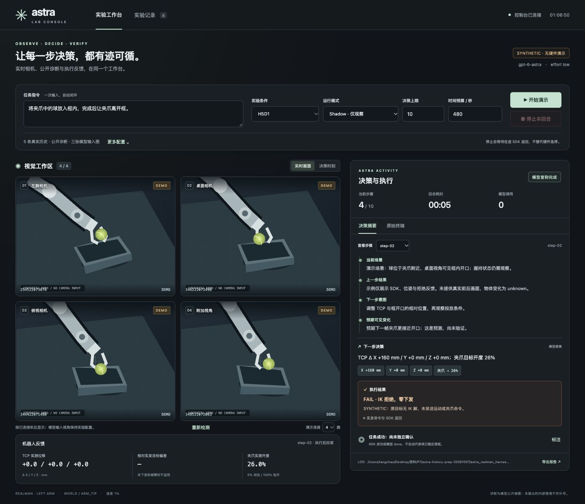

# Astra 一体化实验控制台与全部启动入口

本版在 history/diagnostics 准备版本上增量实现。原 `run_official_astra*.sh`、三/四视角 runner、动作解析、IK、RealMan executor 全部保留。GUI 不自行下发机器人命令，仍启动原 runner；默认 Shadow。没有在本轮进行真实模型推理或真机实验。

## 可以直接做什么

- 左侧固定 2×2，相机启动几路就显示几路；缺失、超时、画面过期分别提示。支持 0–4 路，不要求第四路才能打开 GUI。补接相机后在空闲时点“重新检测”。
- 右侧展示 D1 实际输出的四段公开诊断、原八字段决策的可读摘要、实际下发、SDK/IK、执行后回读。位移显示 mm、旋转显示度、夹爪显示 0–100% 开度；原始 m/rad 数值和响应仍保留。
- `执行成功` 指控制器执行，`模型宣称完成` 指 done，`Success/Fail` 独立结果由观察者填证据；三者分开显示。IK 拒绝会显示 FAIL、原因和零下发，不把它伪装成动作完成。
- 任务、profile、Shadow/Execute、max steps、预算、布局、实验编号、阶段，都可在 GUI 修改；支持 JSON 导入/导出。
- 运行/停止、逐步回看、实时画面/决策时刻图像切换、原始终端、历史回合、独立结果标注和 JSON 报告导出。
- 原始终端保存完整文件；网页显示最近 600 行。历史回合原始终端按本回合关联，不串用当前回合日志。
- D0/legacy 没有公开诊断时如实说明，不补写模型内部推理。



## 最快打开方式

本地 Mac 先看演示（无相机、模型和硬件调用）：

```bash
cd '/Users/tangchao/Desktop/资料/P7/astra-history-prep-20261007/astra_realman_harness'
bash launch/demo.sh --open-browser
```

访问 [http://127.0.0.1:8877](http://127.0.0.1:8877)。演示始终标为 SYNTHETIC；可切换 0–4 路模拟连接，模拟正常动作、IK 拒绝和 done。此演示中的日志、数值和图形不能当作真实实验结果。

实验室工作站，本版解包到下文的新目录后：

```bash
cd /home/tongji/alex/astra_gui_20261007/astra_realman_harness
bash launch/gui.sh
```

默认尝试打开相机，**不会自动开始实验**。在浏览器填写任务，选择模式，然后点击开始。模型 bridge 仍需在 Mac 保持运行。

Mac 远程使用（在 Mac 本版目录）：

```bash
# 终端 A：若原 bridge 已在运行，不要重复启动
bash launch/bridge_mac.sh

# 终端 B：启动实验室 GUI、建立 SSH 转发并打开浏览器
ASTRA_LAB_ROOT=/home/tongji/alex/astra_gui_20261007/astra_realman_harness \
  bash launch/mac_gui.sh
```

`mac_gui.sh` 默认 SSH 主机为 `yanglab`。可用 `ASTRA_LAB_HOST` 修改主机别名；bridge 保持原来的 yanglab 配置，并未泛化已有模型接入。关闭终端时 GUI 请求原 runner 停止，并等待在途 SDK 返回及回读；不会强杀机器人进程。

如果工作站 GUI 已启动，只建立转发：

```bash
ssh -N -L 8877:127.0.0.1:8877 yanglab
```

只看四相机，不提供实验启动能力：

```bash
bash launch/cameras.sh --port 8877
```

GUI 默认监听 127.0.0.1；写请求需本会话 token 与同源校验，不对外开放。无需 npm、前端构建或外网字体。真实相机用已有 pyrealsense2；JPEG 预览优先复用 Pillow，缺失时使用标准库 PNG。

## 所有启动脚本

在 harness 根目录运行，路径均为 `launch/` 下。

| 脚本 | 用途 | 默认 |
|---|---|---|
| `gui.sh` | 一体化控制台 | 8877，只开相机，手动开始回合 |
| `cameras.sh` | 只读 2×2 相机 GUI | 禁用实验启动 API |
| `demo.sh` | 无硬件演示 | 四路 synthetic |
| `mac_gui.sh` | Mac 一键启动远端 GUI + SSH 转发 | yanglab，8877 |
| `bridge_mac.sh` | 原 Codex Astra Mac bridge | 沿用原代码和鉴权 |
| `experiment.sh` | 通用实验启动器 | H5D0、shadow、10 步、480 秒 |
| `H1D0.sh` / `H5D0.sh` / `H1D1.sh` / `H5D1.sh` | 四种新增 profile | shadow |
| `legacy1.sh` | 旧三视角一轮 previous | 旧 runner，shadow |
| `legacy5.sh` | 旧三视角五步 history | 旧 runner，shadow |
| `legacy4.sh` | 旧四视角 | 旧 runner，shadow |
| `placement.sh` | 放框片段 | 10 步、480 秒 |
| `full_pick_place.sh` | 完整抓放 | 50 步、1200 秒 |
| `prepare_pairs.sh` | 生成六局成对实验计划和命令 | 不启动模型或硬件 |
| `replay.sh` | 固定观测条件对照 | 默认只准备输入 |
| `report.sh` | 多回合统计和耗时报告 | 不运行模型 |

`gui.sh` / `experiment.sh` 优先使用 `ASTRA_PYTHON`，其次实验室 `/home/tongji/miniconda3/envs/dp/bin/python`，最后 python3。其他辅助脚本可显式设置同一个变量。`--help` 查看实际参数。

## 配置示例

建议优先 CLI 参数或 JSON；新统一脚本的模式参数是 `--mode execute`，原脚本的 `execute` 位置参数仍保留。

```bash
# 修改 maxstep、任务、条件（真实执行）
bash launch/H5D1.sh --mode execute --max-steps 12 --wall-budget-s 600 \
  --task '将夹爪中的球放入框内，完成后让夹爪离开框。' \
  --layout-id L2 --trial-id placement-03

# 只观察模型决策，不执行动作
bash launch/H5D0.sh --mode shadow --max-steps 3 --task '观察球与框的位置。'

# 任务不写 --task 时，开始前输入一次，之后自动闭环
bash launch/H1D1.sh --mode execute --max-steps 10

# 完整抓放；候选条件由前六局结果决定
bash launch/full_pick_place.sh --profile H5D1 --mode execute \
  --task '抓起桌面的球并放入框内。' --trial-id full-01

# 旧入口也能修改 max steps 和任务
bash launch/legacy4.sh --mode execute --max-steps 20 \
  --wall-budget-s 900 --task '抓球放框。'

# 打印具体命令，不连相机/模型/机器人
bash launch/H5D1.sh --print-command --max-steps 8 --task '抓球放框。'
```

所有数值动作都由模型产生，GUI 不修改动作、不跳过 guard、不重试失败命令。速度保持1%，D 开关不改变 effort。

原生 H profile 使用内部 monotonic 预算；legacy wrapper 用 monotonic Timer 发送 SIGINT，保留原 runner 停止语义，并输出 BUDGET 事件。GUI 另保存 `gui_budget.json`。打印的 legacy 裸 runner 命令本身没有预算，需要通过 wrapper 启动才有此计时。任何模式的停止/预算均不是硬件急停，block=1 已下发运动可能先完成，不能保证墙钟硬中断。

JSON 示例已经提供：`config/experiment.example.json`。

```json
{
  "profile": "H5D1",
  "mode": "shadow",
  "task": "将夹爪中的球放入框内。",
  "max_steps": 10,
  "wall_budget_s": 480,
  "phase": "placement",
  "layout_id": "L1",
  "trial_id": "placement-01",
  "preview_port": 8765
}
```

```bash
bash launch/experiment.sh --settings config/experiment.example.json
# CLI 覆盖 JSON；将同一份配置改为真机、12步
bash launch/experiment.sh --settings config/experiment.example.json --mode execute --max-steps 12

# 环境变量也可用；显式 CLI 优先
ASTRA_MAX_STEPS=15 ASTRA_TASK='抓球放框。' ASTRA_MODE=execute bash launch/H5D1.sh
```

优先级：默认 < JSON < 环境变量 < wrapper 默认参数 < 用户最后给出的 CLI 参数。profile 专用脚本明确选定该 profile；`--profile` 仍可显式覆盖。界面的配置导出可直接用于 `--settings`。

## 六局计划、回放、报告

```bash
bash launch/prepare_pairs.sh --output logs/paired-new --max-steps 10 --wall-budget-s 480 \
  --task '将夹爪中的球放入框内，完成后让夹爪离开框。'

bash launch/replay.sh --run logs/实际回合 --step 3 --output logs/fixed-step3-new
# 现场真实模型固定观测检查（不执行动作）
bash launch/replay.sh --run logs/实际回合 --step 3 --output logs/fixed-step3-inference \
  --infer --profiles H5D0 H5D1

bash launch/report.sh logs/回合1 logs/回合2 --output logs/report-new
```

生成的成对命令仍调用保留的 history launcher，六局次序 L1 D0→D1、L2 D1→D0、L3 D0→D1。局间恢复布局与夹持，不要把六局串行盲跑；每局内部自动运行。

## 真实相机与实验保持一致

- GUI 的 `CameraHub` 是唯一物理视频流持有者。子 runner 的 `SharedCameraSession` 通过鉴权 loopback 请求该帧组，不重复打开相机。
- 三视角 profile 仍只取原三路当前图。第四路只供界面监看，不进入 H/D 对比。legacy4 仍需要四路。
- 少相机时界面可正常预览；如果所选实验要求的相机不足，“开始”会明确报错，不降低模型协议要求。
- `camera_session.snapshot` 只增加可选机位子集参数；默认调用行为保持。缺失的第四路不会污染三视角 snapshot 的 failures。
- GUI 运行时不要再用旧终端入口重复打开同一组相机。要切换到原终端流程，先结束当前回合并关闭 GUI；所有旧入口仍可原样使用。
- 所有 live 启动共用原 `/home/tongji/alex/astra_realman_harness/logs/auto-pick.lock`；legacy wrapper 在隔离目录中也持有该锁。GUI 重复点击开始会被服务端拒绝。

## 日志与结果

- GUI 会话：`logs/gui-session-*/`，各次 settings JSON 与完整 console.log。
- 实验回合：仍为原 runner 的 `logs/left-measured-*` / legacy 路径；`gui_launch.json` 关联本回合 console、设置与 GUI/采集源文件 hash。
- 新 profile 的 transition、prompt、动作、诊断、回读和 timing 保持原文件格式。
- GUI 标注写 `independent_observation.json`，并另存带 UUID 的标注历史；未知原因允许 unknown。不会把独立标签、旧诊断或截图标注回灌模型。
- 历史“决策时刻”严格读取该 step 的 input 图，不拿 after 图代替。没有第四路时第四格明确无图。
- 报告既保留失败，又区分独立观察结果和模型 done。synthetic 演示有醒目标记，不能混入真机统计。

## 部署与回滚

本次独立包：P7 下 `astra-gui-20261007.tar.gz`。旧的 history-prep 包不覆盖。

Mac：

```bash
scp '/Users/tangchao/Desktop/资料/P7/astra-gui-20261007.tar.gz' yanglab:/tmp/astra-gui-20261007.tar.gz
```

实验室（新目录必须不存在）：

```bash
mkdir /home/tongji/alex/astra_gui_20261007 && \
tar -xzf /tmp/astra-gui-20261007.tar.gz -C /home/tongji/alex/astra_gui_20261007
ln -s /home/tongji/alex/astra_realman_harness/config/codex_astra_bridge.token \
  /home/tongji/alex/astra_gui_20261007/astra_realman_harness/config/codex_astra_bridge.token
```

包内不含 token、运行日志、.git。回滚时结束新 GUI / 当前回合，再使用原 `/home/tongji/alex/astra_realman_harness/run_official_astra*.sh`；没有覆盖原目录。

## 验证与现场事项

- 新 GUI/launch/API 测试 11 项通过（本地 HTTP 使用真实 loopback，模型与硬件均 mock/synthetic）。覆盖命令参数无 shell 插值、0–4 相机、缺第四路的三视角快照、重复启动、正常/失败摘要、独立标注、共享帧接口、同源与 token 校验、路径限制。
- 原 history 验收 9 项、相机回归 3 项通过。全量 281 项中 225 项通过，55 errors 与 1 failure 和此前基线一致，没有新增失败；原始结果保存在 `docs/gui-verification/`。所有新 shell 的 bash -n、Python 语法、JS 语法检查通过。
- 已在浏览器检查桌面左右布局、窄屏布局、模拟 IK 拒绝、少相机显示和停止请求。截图为明确 synthetic 场景。
- 本轮未访问真实相机、机器人或模型。现场仍需核对 RealSense 帧率/接入、SSH 转发、bridge 登录与 D1 schema 接受性，再用第一步正常实验确认 GUI 摘要和 transition/原终端一致。

## 补充：同一工作台的操作流程

检查配置 / 查看命令只检查本地配置和相机缓存，不连接机器人、不调用模型。
“仅运行一次 Shadow”冻结当前任务，以 shadow + max_steps=1 启动独立回合，不改表单原值。
六组选项只载入布局和 H5D0/H5D1 条件；需要人工复位后手动开始，不自动串行跑实验。
运行期间任务与实验参数锁定；点击历史步骤自动切换为该步骤真实决策输入图。
相机标签区分模型输入与仅预览，历史帧显示采集时间和观测 ID。
模型公开诊断是模型判断，实发命令与 SDK/实测反馈独立展示；work +X 不等于图像右侧。

GUI 保存 gui_launch.json 与启动 session manifest；统一 CLI 保存 launch_manifest.json。
包含原样任务、argv、相机配置、模型/effort、Git revision、已跟踪实现文件 diff 和未跟踪实现文件名。
不记录环境变量或认证值。归档部署不带 .git 时读取包内 BUILD_REVISION；未提供时显示 UNAVAILABLE。每回合保存实现文件 SHA256，可与发货包核对。
三视角条件的相机启动/取帧只等待前三路；第四路为同一 owner 的可选预览，legacy4 仍要求四路。
