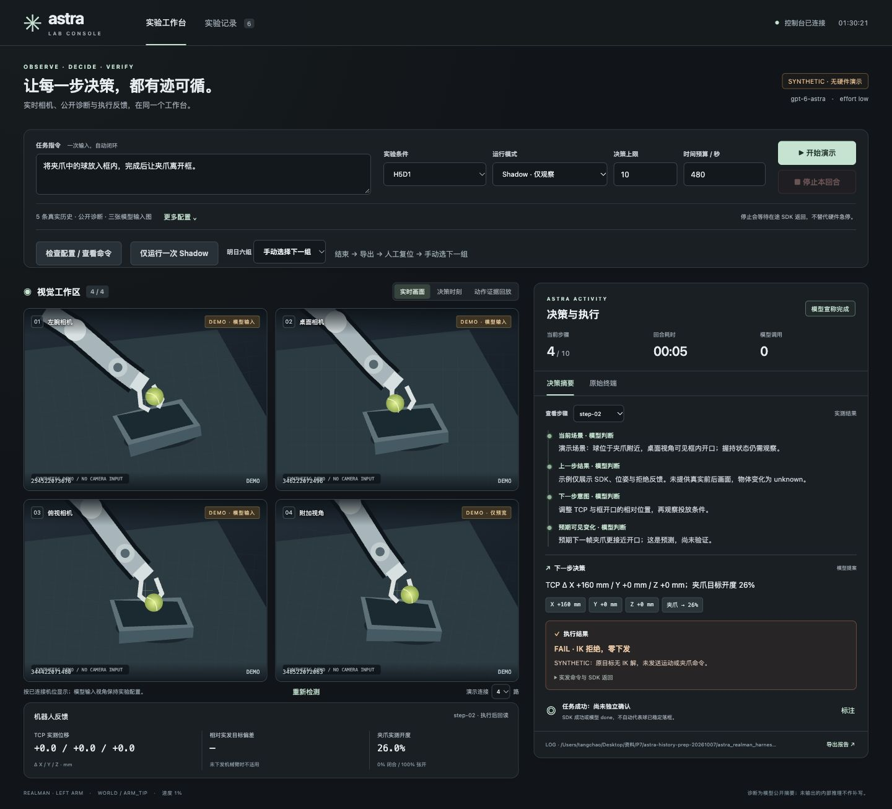

# 统一控制台、证据回放与离线对照交付

在 `codex/history-diagnostics-20261007` 上增量完成。GUI/流程与新增回放分别提交，未合并 main。
原 CLI、H1D0/H5D0/H1D1/H5D1、legacy1/5/4 保留。没有改写任务、加抓放状态机、修正模型动作、自动重试或更改速度/effort。



## 明天第一个操作

先把此包部署到**新目录**并启动 GUI，查看前三路相机和配置检查；此时不要点 Execute。以下部署命令仅交付，未替你在实验室执行。

Mac：

```bash
cd '/Users/tangchao/Desktop/资料/P7'
shasum -a 256 -c astra-console-replay-20261007.sha256
scp astra-console-replay-20261007.tar.gz yanglab:/tmp/astra-console-replay-20261007.tar.gz
```

实验室（新目录已存在则停止，先核对已有内容）：

```bash
mkdir /home/tongji/alex/astra_console_replay_20261007 && \
  tar -xzf /tmp/astra-console-replay-20261007.tar.gz -C /home/tongji/alex/astra_console_replay_20261007
ln -s /home/tongji/alex/astra_realman_harness/config/codex_astra_bridge.token \
  /home/tongji/alex/astra_console_replay_20261007/astra_realman_harness/config/codex_astra_bridge.token
```

Mac，两个终端；若原 bridge 已运行，复用它：

```bash
cd '/Users/tangchao/Desktop/资料/P7/astra-history-prep-20261007/astra_realman_harness'
# 终端 A：保持运行
bash launch/bridge_mac.sh
```

```bash
cd '/Users/tangchao/Desktop/资料/P7/astra-history-prep-20261007/astra_realman_harness'
# 终端 B：8878 避开本机 8877 合成演示页
ASTRA_GUI_PORT=8878 \
ASTRA_LAB_ROOT=/home/tongji/alex/astra_console_replay_20261007/astra_realman_harness \
  bash launch/mac_gui.sh
```

浏览器打开 `http://127.0.0.1:8878`。先点“检查配置 / 查看命令”，需要时显式点“一次 Shadow”验证相机—模型通路。检查页本身不探测机器人或调用模型；它不会声称 bridge 在线。
然后人工摆好 L1 / 夹好球，选择六组列表第一组 H5D0，核对原任务、10 步、480 秒，切换 Execute，开始回合。
每回合结束：标注独立结果 → 导出关键步骤证据 → 人工恢复布局 → 手动载入下一组。
六组顺序仍为 L1 D0→D1、L2 D1→D0、L3 D0→D1；选组仅填配置，绝不自动启动下一局。

## 启动与配置

全部原脚本及参数映射见 [完整启动说明](GUI_AND_LAUNCHERS_20261007.md)。在工作站本版 harness 目录：

```bash
# 统一 GUI（只有相机监看；实验由按钮显式开始）
bash launch/gui.sh --port 8877

# 只读 2×2 相机
bash launch/cameras.sh --port 8877

# 原统一 CLI；使用 CLI 前先关闭 GUI，避免重复打开相机
bash launch/H5D1.sh --mode execute --max-steps 10 --wall-budget-s 480 \
  --task '将夹爪中的球放入框内，完成后让夹爪离开框。' \
  --layout-id L1 --trial-id placement-02

# 修改 maxstep 和输入任务；这里只做单次 Shadow
bash launch/H1D0.sh --mode shadow --max-steps 1 --wall-budget-s 180 \
  --task '观察当前球、夹爪和框的位置。'

# JSON 导入，CLI 参数覆盖；原任务字符串（含空格/换行/中文）不重写
bash launch/experiment.sh --settings config/experiment.example.json --max-steps 12

# 保留原固定观测对照入口；默认只准备，不调用模型
bash launch/replay.sh --run logs/实际回合 --step 3 --output logs/fixed-step3-new
```

GUI 的“仅运行一次 Shadow”把本次运行冻结为 shadow + 1 步，表单中的原设置保留。
GUI 给出可复制的等效完整 wrapper 命令；实际进程使用 argv 数组，不把任务交给 shell 插值。
`launch_manifest.json` / `gui_launch.json` 保存 argv、原任务、实验配置、相机序列号、Git/build revision、代码差异/实现文件 SHA256、模型/effort。归档包附 BUILD_REVISION，配置与真实运行日志均不打包。

## 同界面只读回放

选历史回合及步骤，点“动作证据回放”。

- 左侧优先读取该步 `pre-execution/observation.json`；切换到“模型决策输入图”可单独核对当时模型看见的图片。缺执行前图就明确缺失。
- 右侧只读取该步 `next_observation.json`，没有时读取该步 `after/observation.json`。不取相邻步骤填空。
- 按 serial + role 配对，显示观测 ID、时间、原始 PNG 尺寸、SHA256；核对 transition 图像引用、step/episode、执行前时间。哈希、尺寸或引用错误时不展示为有效图。
- 动作记录分成提案、实发通道、SDK/IK、实测 TCP/夹爪；IK 拒绝显示零下发，残差不作执行证据。work +X 不等于图像右侧。
- “第一次接近框 / 第一次释放尝试 / 第一次明显偏离”均为人工事后标记，观察者及依据必填，独立保存，绝不进入模型输入。原因未知可写 unknown。
- 证据 ZIP 含选中步骤的图像、模型输入/输出、transition、配置、版本、人工标记和 manifest。图像内容寻址，路径改为包内相对路径，逐文件记录 hash；缺失明确保留。只允许已知证据文件，认证字段/已知 token/常见 key 格式脱敏，不上传外部服务。
- real / synthetic、模型 done / SDK 成功 / 独立物体成功分开。合成演示的录制帧为 1×1 数据流测试图片，不是场景证据；实时监看演示图也不是模型输入。

## 人工核验的固定观测诊断对照

回放窗展开“离线诊断对照”，载入当前图片模板。只用当前观测填写人工核验内容，然后点准备。
得到三个独立条件：原始输入、仅增加视觉位置核验、仅增加当前任务状态核验。其余任务、机器人状态、合法历史和图片保持同一基线。GUI 只准备文件，显示 model_calls=0、executor_present=false，并提供 ZIP。

CLI 同一实现：

```bash
bash launch/diagnostic_controls.sh --run logs/实际回合 --step 3 \
  --annotation-template > logs/verified-step3.json
# 编辑这个新 JSON 文件后：
bash launch/diagnostic_controls.sh --run logs/实际回合 --step 3 --base-profile H5D1 \
  --annotation logs/verified-step3.json --output logs/controls-step3-new
```

`reference_images` 保留模板原值；`observer` 填观察者。`visual_positions` 的一个条目示例（坐标仅为格式示例，须换成实际人工核验值）：

```json
{
  "object": "ball",
  "camera_serial": "346222072496",
  "coordinate_system": "pixels_top_left_x_right_y_down",
  "xy": [320, 240],
  "source": "human_verified_current_image"
}
```

对象限定 ball/gripper/basket；像素坐标左上原点、x 向右、y 向下，范围 `[0,width)` / `[0,height)`，引用原图尺寸。
也可使用 `normalized_0_1000_top_left_x_right_y_down`，转换明确记录为 `x*(width-1)/1000` 与 `y*(height-1)/1000`。不猜测 3D 坐标。

当前握持状态示例：

```json
{"holding":"unknown","evidence_camera_serials":[]}
```

holding/not_holding 必须列出当前图片证据相机；不确定用 unknown。schema 不接收下一动作、最终成功、失败原因或完整轨迹等字段。人工标注是否真实仍由观察者负责。
如要真实离线推理，使用**新的输出目录**并显式添加 `--infer`：每个条件一次模型调用，始终没有执行器和后续 rollout。不同提案不能拿旧轨迹中的未来图当作结果评分。

## 独立“三张当前图 + 一张历史固定相机图”

此项已准备输入构建、GUI/CLI、后端传输和导出链路，尚未接入 live 执行，不改变 H5D1。

```bash
bash launch/diagnostic_controls.sh --run logs/实际回合 --step 3 \
  --base-profile H5D1 --visual-history-mode previous_fixed_before \
  --fixed-camera tabletop --output logs/visual-history-step3-new
```

前 3 张严格沿用原输入校验与顺序；第 4 张来自上一个已完成步骤的 `pre-execution/observation.json`，固定桌面或俯视 serial + role。
要求 prior step/episode、完成时间、动作前时间、图片 hash/尺寸及观测身份合法；不能是当前观测或上一步 after 观测。第一步或缺少 before 记录时 manifest 明确标 MISSING，只有三张，绝不伪造第四张。
独立记录 `base_profile` 和 `visual_history_mode`；原 H5D1 仍为三张当前图 + 五条已完成实测 transition。视觉历史与人工核验对照不在同一条件混用。
准备目录附 `prepared-evidence.zip`，包含模型上下文、实际附件列表与图像、合法历史和 manifest。默认零模型调用，真实推理需显式 `--infer`。

## 验证结果及未核实项

- GUI/API/启动器 12 项、流程与预览 4 项、回放与独立输入 11 项、原 H/D 9 项、相机 3 项：39 项相关测试全部通过。
- 全量 297 项，241 通过，55 errors + 1 failure；失败项目集合与此前基线完全一致。原因包括本机缺少实验室归档、原 token、numpy/transforms 等；未将这些项目标成通过。完整输出见 `gui-verification/replay-full-suite.txt`。
- Python/JS/shell 语法通过；浏览器验证配置检查、冻结历史步骤、IK 零下发前后图、人工标记、原始/视觉/状态三组准备及 3+1 准备。
- 预览开关模拟比较：三路帧龄均 10 ms、跨度均 2 ms；snapshot_count/last_sequence 不被预览消耗，快照不多等待；此次全量测试采样 0.049 / 0.047 ms。该数值仅为一像素假帧数据流验证，不能外推为 RealSense 或推理性能。
- 四附件已通过真实 backend 编码/上下文一致性 + mock HTTP payload + bridge CLI 四次 `--image` + portable ZIP 校验；未作在线模型调用。
- **未核实**：实验室部署、真实三/四路 RealSense 吞吐与帧龄/跨度、GUI 预览开启时的 CPU/端到端推理延迟、SSH/bridge 在线状态、真实模型对 D1/3+1 的接受性、真实 SDK 回读与实物结果。
- 没有推送、部署或真机动作。保留明日原实验路径；如现场新 GUI 有问题，结束 GUI 后回到原 CLI。停止为合作式停止，需等待在途 SDK 返回，不替代硬件急停。
