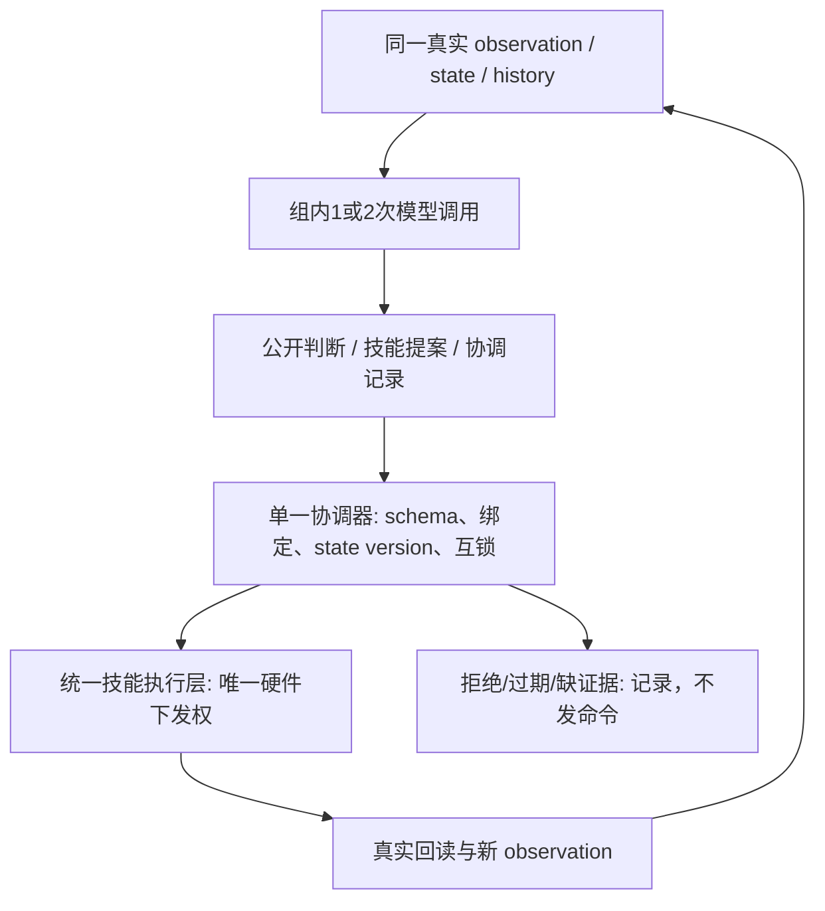

# E4 实验卡：决策分工与多 agent

2026-10-07；设计稿，未实施。此卡是用户追加的独立 E4，不改写 E1/E2/E3，不执行四方向全组合。本轮没有真实模型调用、硬件操作、运行代码修改或新框架实现。预算均指下一轮获准后的实验上限，不是本轮已消耗量。

## 1. 一页结论与第一批工作

要回答的是：**在相同观测、历史、技能和执行保护下，按臂或按职能分工，是否比一个 agent 多检查一次更有价值？哪些片段不值得付协调成本？** “一臂一个 agent”已有先例，不作为创新主张。

| 组 | 决策角色数 | 每个完整决策周期的模型调用 | 核心对照 |
|---|---:|---:|---|
| S1 | 1 | 1 | 集中式单次决策，最低调用开销 |
| S1+ | 1，同一集中式职责 | 2，串行 | 草案后自查/修正，检验额外计算本身 |
| A2-arm | 2，左臂责任、右臂责任 | 2，串行 | 左侧草案 → 右侧检查/修正并最终提交；当轮提交能力与S1+相同 |
| A2-role | 2，观察判断、技能决策 | 2，串行 | 证据判断 → 技能提案，检验职能分解 |

首批只做固定观测，不发动作：复用原 pilot 的 G 数据集 **16 个检查点：4 开发、12 评估**；开发每组一次，评估每组两次，合计 **196 次请求上限**。先运行开发部分的 **28 次**，检查协议和判分是否有辨别力，再解封评估集。本卡没有启动这些请求。

跨臂交接/恢复另留 **98 次请求**，待真实双臂证据具备后开展；不拿 foundation 的 synthetic 图和持物 oracle 冒充真机。通过筛查后才做四组、三类短片段的 **24 个闭环回合，最多336次请求**。E4完整分阶段上限为 **630次请求**；不是立即全部运行。预算细节见第7节及 `E4_PILOT_MATRIX.csv`。

E1/E2/E3 原预算712次、24回合保持不变。E4复用数据，不默认复用模型输出：新角色/消息/schema使请求不同。若全部阶段都展开，四方向请求上限为1342；E4新增最多24个比较回合＋4个双臂参考采集回合，故总物理回合上限52。现场技能验证和复位耗时尚不能可靠定额，单独列为前置工程工作，不暗藏到实验收益中。

## 2. 已核实的实现与文献

### 2.1 代码依据与状态

稳定 foundation 检出：`/Users/tangchao/Desktop/资料/P7/astra-bimanual-sort-20261007`；分支 `codex/bimanual-sort-foundation-20261007`，HEAD `5c24866791106711a1945c60435a4d27e639bef6`，本卡核查时clean。下列相对路径均从其 `astra_realman_harness/` 起算。

- `bimanual_demo/runtime.py:Runtime` 当前仍直接实例化 mock arms / SyntheticObserver；不是已接通真实模型的双臂闭环。
- `bimanual_demo/protocol.py:parse` 有高层技能schema；`DisabledAstraBackend` 明确禁止真实模型。`state.py:TaskState.admit/evidence/confirm/recover` 已有版本、证据和状态顺序规则。
- `runtime.py:execute/gate/command` 有单一调度、operation去重和交接互锁。`skills.py:handoff` 将右侧持物确认、左释放、左退出分开；`recover` 不自动运动。这些在foundation是mock验证能力，**不等于现场持物核验器已实现**。
- `codex_astra_backend.py:CodexAstraBackend.decide` 支持传入schema/parser、归档请求和usage，可作为未来角色调用的底层运输；目前它要求 `images_in_attachment_order` 及logs内PNG，高层context不能未经适配直接塞入。
- `Runtime.context()` 的snapshot含累积events；“recent evidence[-5:]”不是五条完整实测transition，也不能据此声称已有严格有界高层history。E4复用原pilot拟定的统一事实投影，不另做压缩实验。

另一个Mac开发目录在本轮被并行工作更新；19:45核查为 `codex/single-astra-parallel-arms-20261007`，HEAD `60f4a78c9b0eed0209c6621a48b100dc0445e565`，`config/arm_mirror.json` 有未提交修改。本任务未修改或覆盖它。60f4a78提供ArmStack/右臂镜像接口，但不自动证明真实交接已验证。E1/E2/E3文档中的分支状态是其较早审查时点，内容保持不变。

**实施前冻结一个共同新baseline，不能一组用5c、一组用并行改动。** 不用变动中的工作区作实验版本，不把synthetic的 `.35` opening或示教坐标当作现场参数。

### 2.2 bridge 并发：本轮确实检查了什么

只读进程记录显示 PID 99825 运行 `/tmp/codex_astra_mac_bridge.py`，PID 99827提供反向转发：远端 `127.0.0.1:18766` → Mac `127.0.0.1:18767`。没有发送 `/decide`，没有压力测试，也没有修改/重启bridge。

磁盘脚本SHA256：`0c6c386aecb16ddd137a7a7dd8f76b6d78473cd2f54a488bcb92f0b75d8549b7`。

| 依据 | 结论 |
|---|---|
| `/tmp/codex_astra_mac_bridge.py:9,75–83` | 全局BUSY锁；`acquire(False)`失败直接HTTP409，**没有模型请求队列** |
| 同文件`:93` | ThreadingHTTPServer允许处理HTTP线程，不代表可并行跑两个模型 |
| 同文件`:11–23,46` | `gpt-6-astra`、medium、official provider，ephemeral/read-only，无工具；单CLI请求120s超时；每次1–4张PNG |
| `CodexAstraBackend.decide` | 同步等待一个结果；409进入backend transport error，没有透明多agent调度 |

因此当前可部署容量按 **1个in-flight模型请求** 设计。S1+/A2两次请求顺序await；不为E4修改并发、不启动多个bridge规避锁。其余正在进行的实验占用bridge时，E4应等待独占实验时段；409是基础设施失败，不是协调失败，不偷偷重发。

进程路径＋磁盘文件不等于对进程已加载字节的完整证明；实际请求仍须保存 `command.json`、bridge SHA、CLI版本和effort。已有真实A/B日志已核实完成调用为medium，而foundation归档bridge源码仍写low；该差异不能忽略。真实服务端计算/令牌预算、隐藏上下文及支持更多并发均为UNKNOWN。

### 2.3 RoCo 与 BiCICLe：用于设计的核对

**RoCo：** 每机器人有对话角色，轮流查询并利用环境反馈修改计划，最终由集中式多臂规划器执行。其Central Plan对照拿到全局观测、全部能力及相同反馈；因此原论文的部分比较混有信息分配差异。集中式与对话式各有强项，不支持“多agent普遍更好”。本实验改为所有角色都可见同一完整观测。[原论文§3、§5.1](https://arxiv.org/html/2307.04738v1)

RoCo附录的示例计时中，平均7.1环境步却有43.8次GPT-4请求；主要等待来自对话调用。它也报告错误声明被其他角色重复的失败。[官方附录§X、§XI](https://project-roco.github.io/roco-icra-appendix.pdf) 官方 `DialogPrompter` 按角色顺序调用，另有replan循环和请求重试；角色数不等于调用数。[实现](https://github.com/MandiZhao/robot-collab/blob/main/prompting/dialog_prompter.py)

**BiCICLe：** SA一次预测双臂；独立DA两臂不通信；leader→follower则后者条件于前者轨迹，存在串行依赖。Arms’ Debate一次推断4次调用；Best-of-N的5对候选加5次评审为15次。输入是物体位置/示范的文本表示，与本项目RGB＋实测状态并不等价。[论文§3–4](https://arxiv.org/html/2604.20348v1)

其附录E在Lift Ball报告的每回合均值/中位墙钟为：基础版3.8调用、约21.5k token、125.3s；Debate12.3、73.8k、278.2s；BoN33.5、180.7k、149.7s。BoN调用多但有独立请求并行；Debate增加串行链。该任务Debate没有优于基础版。**这些是含网络的该论文配置结果，不是本bridge的速度预测。**[论文附录E、表10](https://arxiv.org/html/2604.20348v1#A5)

官方仓库还列出 `SequentialArms` 这个共享模型、两次顺序单臂预测的降维对照；不能把“两个命名角色”直接当作独立智能的证据。[官方实现说明](https://github.com/alesspalma/icl_bimanual#agents-and-methods)

本卡不是这两套系统的复现：不搬入其位姿离散尺度、示范真值或全轨迹开环执行。采用的是**计算匹配、信息匹配和串行成本审计**。暂不引入论文中的无限讨论、BoN或额外judge。

## 3. 四组共同冻结项

1. 同一官方 `gpt-6-astra`、medium、模型配置/CLI/bridge版本，读只读当前附件；隐藏服务端状态未知如实记。角色只是同一模型的不同调用职责，不是不同权重或能独立操作硬件的进程。
2. 同一技能目录、目标/示教知识、已核验frame/tool、速度/负载、技能内检查与观察点；每周期至多提交**一个公共高层skill**，不是每agent各执行一个。技能内部可跨臂，但调度权只在统一执行层。
3. 同一场景、task逐字相同；首批单臂片段沿用E1短任务。未来交接片段使用foundation的左拾取→交接→右分类投放定义，不复活“右臂持盒”旧任务。
4. 首批输入固定G三路640×480当前图，保留其完整raw state、frame/tool、技能phase、相机/layout/calibration revision；两次调用都得到同一份完整附件和基础context。G为单臂来源，若没有右臂实测state，各组均标UNKNOWN并禁用右臂动作，不能凭空补右臂正常/已退出；A2-arm在P/V的右角色仅审查不参与动作的边界。H必须另有真实双臂state。A2-role的决策者**也看原图**，避免“只看摘要”的额外瓶颈混入角色分工。
5. history固定最近五条已完成实测transition＋公共当前状态＋最近未解决失败；不使用E2选图或E3候选压缩，不随组删事实。不加入隐藏角色私有长期记忆。角色消息仅本周期使用；上一周期的最终提案/拒绝按同一公共result格式留证。未执行拒绝不能伪装成完成的机器人transition。
6. E4统一输出一个小型公开证据信封＋现有高层proposal；不索取隐藏推理。证据信封是本实验共同输出契约，不沿用/改名原H/D；旧四段diagnostics保持原样。各组最多6条证据判断，每条简短说明≤240字符，绑定来源，未知可明确unknown。
7. 所有条件同样校验实际输入、schema、state版本、revision、operation去重、交接互锁、STOP和硬件错误。任何新增现场验证器/安全修复先冻结新共同baseline，再开始比较。

S1+与两个A2组是**调用数匹配**，不是token或隐藏计算精确匹配。它们第一阶段输出不同长度，实际usage必须报告；不通过填充无意义文字“凑token”。S1少一次请求，体现真实最简方案。若A2只胜S1而不胜S1+，证据更支持“多一次计算”而非角色分工。

## 4. 调用图、消息与确定性协调

### 4.1 公共消息契约（设计，不是已新增schema）

每次请求都带相同 `episode_id / cycle_id / observation_id / state_version / revision / context_hash / attachment_hashes / skill_catalog_hash`。`role_id / call_index / parent_call_id`写在角色信封与日志。操作ID由协调器签发一次；模型不能靠重命名重放。

中间消息：`claims[{predicate, value: true|false|unknown, evidence_refs, source:model_judgment}]`；按臂组额外有 `responsible_arm / candidate_skill / partner_requirements`；自查组带第一份draft；观察组不含可执行命令。claims只是模型判断，不能被当作 `validated_observer` 事件或写入权威holder。

最终消息：`{binding, claims, proposal}`；非空`proposal`通过 `bimanual_demo.protocol.parse`，原有高层action/对象/类别/目的地/版本语义不变。S1+与A2-arm同样附带`draft_hash / revision_kind: KEEP|REVISE|NO_PROPOSAL`协调记录；NO_PROPOSAL的proposal为null，公共提交层记录不派发，其余提交完整proposal。能力缺失、unknown时只能请求既有OBSERVE/证据重查或同样不提交，不能编造新技能。E1短放置原语schema尚待实施，若首批采用它，各组共享同一个冻结schema和适配器，不能假称foundation已有左臂放置技能。

### 4.2 S1

`共同观测 → 集中式角色1次调用 → 最终信封 → 公共校验 → 一个skill`。

同一调用完成证据判断和技能提案。只有公开结论/证据引用；不额外调用视觉评审或成功判断模型。角色数1，调用上限1。

### 4.3 S1+

`共同观测 → 同一集中式职责生成draft → 原观测＋原draft进行一次自查/修正 → 最终信封`。

第二次仍负责全局任务，不改名为左右专家，也不给独有工具/观测。可保持或修改第一份proposal；两份原文都保存。第二次超时/非法则本周期无可执行输出，不能悄悄用第一份回退。固定两次，无第三次judge、格式修复请求或直到正确为止的循环。

### 4.4 A2-arm

首批固定左角色先发，因为任务的物物流是左→右；该次序是条件的一部分，不宣称方向对称，也不按结果择优换leader。

1. 左角色读全量共同观测，提出**一个公共next skill候选**及自己负责的左侧约束、对右侧的要求。公共skill可以是RIGHT_PLACE：此时左角色只能陈述自己是否退出/是否应hold，不能下发右臂命令。
2. 右角色读相同全量观测＋左消息，输出本臂兼容性证据；与S1+第二调用一样，可以保留或修正第一份公共skill，并在**本周期提交一个完整最终信封**。最终可用技能集合、输出schema、消息预算、拒绝/无动作选项和提交时机与S1+相同。第一调用的对象判断/要求是待核查声明，不能新建额外硬先决条件。
3. 两组第二调用均引用draft hash，并保存 `KEEP / REVISE / NO_PROPOSAL` 及公开理由。KEEP校验最终proposal与draft相同；REVISE可原样提交第二调用的新proposal，不需第三次调用或等待下一周期；NO_PROPOSAL不下发。第二调用失败/非法均不回退到第一份。只允许统一校验层接收一次最终信封，角色仍无SDK或夹爪下发权。

**2026-10-07设计修订：** 主要角色对照现在为同样两次串行调用、同样当轮检查/修正/最终提交能力的S1+与A2-arm。差异保留在职责分工与对应消息内容；记录第一份错误是否被纠正、错误传播和最终提案质量。不能把第二角色生成最终proposal称为独立硬件控制者。

此前严格 `ACCEPT / COUNTER / UNKNOWN`（COUNTER必须等下一周期）的协议仅保留为设计记录，不纳入本批主要角色比较、不新增试验组或请求预算。若以后单独保留该协议，它测的是**角色分工加协调/提交协议整体**，不能据此归因纯角色收益；尤其不能把COUNTER延迟惩罚归因多agent本身。

公共技能库与可达的最终action集合与S1相同。这里不增设每臂waypoint、不开放两个独立proposal给硬件、不做额外IK搜索。临时无动作/协调拒绝只消耗决策和时间预算，不是物理失败；硬件/通信fault仍按共用规则停止。

### 4.5 A2-role

`共同观测 → 观察角色证据信封 → 相同共同观测＋证据信封 → 决策角色最终信封`。

观察角色只判断当前可见的物体身份、持物/放置/交接证据、遮挡和已有反馈的含义，不能发动作或把未经实测的建议包装成事实。决策角色可核查/不同意该判断，选择一个公共skill。记录哪些第一阶段声明被接受/纠正/忽略；引用不等于硬件先决条件已确认。固定两次，不增加第三次审核。

### 4.6 串行和可并行的准确边界

| 部分 | 当前允许/依赖 |
|---|---|
| S1+第二次 | 依赖draft，必串行 |
| A2-arm第二次 | 依赖左消息，必串行 |
| A2-role第二次 | 依赖证据消息，必串行 |
| 模型前文件读取、hash、附件准备 | 独立项理论可重叠；首批复用现有行为，不把未来优化计入收益 |
| HTTP cancel/日志落盘 | 不等于两个模型推理并行；STOP可取消当前请求，所有晚到结果不得进入执行 |
| 技能内部双臂 | 由共用控制器决定；所有组同样执行，不能把双臂并发只给A2 |
| 多个episode并发推理 | 当前bridge不支持；顺序随机交错测量，409不算模型能力错误 |

未来独立双agent第一轮可并行只是另一种协议，不在本批四组中偷偷启用。也不把生成两个角色配置称为已经获得两路模型吞吐。

## 5. 唯一硬件下发权与过期结果



- 冻结周期观测；两个调用间不执行任何skill。执行前重新核实版本/revision、健康、新鲜状态及对象事件。版本或现场状态改变使整个bundle失效，不能偷偷把state_version改成最新。
- `TaskState.version`当前不在每次读图时增长；仅校验整数不够。未来须同时绑定observation_id/图hash与实际state guard，沿用统一时效政策。**不为了容纳两个120s调用放宽状态新鲜度**；超时/陈旧率是成本结果，必要时记录零执行并重观测。模型期间机器人hold不能证明物体/人未移动。
- 右持物证据未确认不得左释放；左退出未确认不得右运输；左右工具/frame不能互换。LLM共识不能创建 `RIGHT_HOLDING_CONFIRMED` 或 `LEFT_CLEAR`。
- 使用既有 `operation_id` / dispatch记录避免重复；STOP后不派发新命令，未知ACK不自动重发。模型调用/消息合并层不得持有SDK session或gripper socket。
- 首批固定观测/反事实协议测试必须不接入executor。真实硬件fault、通信异常不作为“多agent自己想办法恢复”的可继续案例。

## 6. 三类片段、数据与独立判分

| 片段 | 输入/来源 | 比较对象 | 能/不能得出的结论 |
|---|---|---|---|
| P 简单片段 | G的已持球、运输前检查点；两臂均可读但右hold | 下一公共原语/技能选择、调用冗余 | 低协调需求的最简对照；不以A2不占优为全局否定 |
| V 视觉判断片段 | G的退出后、独立放置确认前当前三图；可见/遮挡如实标注 | 球在盒内/外/不可判定，是否有足够证据结束或应复查 | 判断与技能选择分别评分；不能拿历史真实完成状态作为“视觉判断能力” |
| H 交接/恢复片段 | 新真实双臂参考观测：handoff前、持物/退出证据边界；自然失败另存 | 持物主体、阶段、允许/禁止技能、是否需要重新观察或停止 | 只有真实回合才报告物理交接成功；反事实故障仅报告协议正确率 |

**G的选取固定在结果前：** 从E1参考M的D1、D2两开发回合，各取运输前和退出后两个点，共4；T1/T2/T3×2回合各取同两个点，共12。不另采8个G回合，也不从其他组挑“最精彩”图。若某点缺失/只含oracle/当前state已直接给出最终答案，标缺失或无辨别力；不得删掉对照本应可见的合法状态以制造视觉难度。

目前G尚待原pilot接入采集；已有A/B真实日志仅可做协议字段审计/开发例子，不能伪造高层skill标签，也不把旧三白块任务混算为网球任务。要马上开始整理的是G的checkpoint索引模板与证据字段，而不是声称已有16个合格高层样本。

H参考计划4个完整来源回合：1个开发场景、3个不同评估场景，每回合两个候选点。第一个为正常交接边界；第二个优先使用该回合真实发生的“尚未确认持物/退出”或恢复边界。**不故意造成碰撞、掉物或断通信。** 无自然恢复时，可从同一真实快照构建一份明确标记 `COUNTERFACTUAL_PROTOCOL` 的缺证据/未知ACK输入，仅限无硬件回放，不计真实恢复成功。正常与反事实分表，禁止混在成功率分母。若没有合法当前双臂state和共同视觉证据，H全部暂缓，不能用单臂日志补出右臂状态。

参考采集尽量复用E1未来已预算的真实双臂扩展数据；若尚无可用数据，本E4预算预留4个现场显式启动的参考回合（无E4真实模型调用，按已验证示教/脚本采集）。预算里单独计4回合；若实际共享，账本只能计一次。缺少合法技能/持物观察器时这一采集也不启动。

**首批必须保存：** source run/step与分组前hash；三张实际模型附件和原图、timestamp/span；双臂state（缺右真实state时明确不可用于H）、opening/错误/frame/tool；当前phase/version/revision；最近五条真实transition、最近未解决失败；完整技能目录和人工知识来源；每次输入/角色消息/raw/parsed/final的独立文件；所有request/parent关系；原target、实发命令、SDK与after state；线上人工介入；独立标签。不可见的持物/接触事实标unknown，不能由夹爪数字填标签。

两名盲评者只看该时刻合法证据，标注可接受skill集合和事实判断（允许多个合法方案），分歧留存并裁决。图像/执行视频的最终结果标签在单独文件，不回送给模型；不索取隐藏推理。模型中间声明被后一角色照抄却无证据，记为“错误传播”，不是合作成功。

## 7. 精确 pilot 预算与时间

一次cycle的调用上限向量为 `[1,2,2,2]`，合计7。中途失败实际少调用如实计；不自动补足样本、重试API或补第三次格式修复。模型调用计数以请求派发为准，取消/失败亦计attempt；未知usage为缺失，不算0。

| 阶段 | 样本/重复 | 四组请求上限 | 新物理回合 | 执行门槛 |
|---|---|---:|---:|---|
| A开发 | G开发4点×各组1次 | 4×7=28 | 0，复用G | 输入、协议、判分审查 |
| A评估 | G评估12点×各组2次 | 12×2×7=168 | 0，复用G | 冻结角色消息后解封 |
| B开发 | H开发2点×各组1次 | 2×7=14 | 下行已计 | 真实双臂材料具备；反事实单列 |
| B评估 | H评估6点×各组2次 | 6×2×7=84 | 下行已计 | 不与开发来源回合重叠 |
| H参考采集预留 | 1开发＋3评估来源回合 | 0 E4模型请求 | 最多4 | 完成现场双臂接入/示教验证；不是本轮动作 |
| C闭环筛查 | P/V/H三类×2新起点布局×4组×1次 | 6×8×(1+2+2+2)=336 | 24 | 只有通过A/B的组进入；缺组不把结果当完整四组 |
| **合计上限** | 固定24点＋24比较回合 | **294＋336=630** | **最多28新增** | 分阶段停止，不保证全部开展 |

A中P/V各8个唯一点（2开发＋6评估），每组14次cycle；两种片段合计每组28次cycle。B每组14次cycle。模型重复不是新场景；两个来自同一回合的点有相关性。

每个固定观测bundle共同截止240s，单请求≤120s且不得超过剩余bundle时间。S1的单请求仍最多120s，不用等待凑240s。A模型时间的宽松上限196×120=6h32m，B为3h16m；这是全超时边界，不是预估完成时间。正常延迟参考已有单调用约28–30s，但不能把它当新的双调用测量值。编码/归档/标注另报。

C三类片段都固定 **480s / 回合、最多8个决策cycle**；S1≤8请求，另外各≤16，全部调用共享480s时钟，不为A2延长。到期停止派发新模型/硬件命令；在途命令按共用安全收尾处理，超时之后才完成的任务不算预算内成功。实际安全收尾可能超过480s，另记，不强行断电凑时间。24回合预算内时间总上限192min（不含复位/核验）；H参考4回合再预留32min。当前代码尚未实现此预算调度。

其中C-V的8回合是现场**只观察的视觉判断交互片段**：从尚无最终确认的真实观测开始，允许再次OBSERVE或提交有依据的核验判断，不允许动作。计时从首份输入开始到正确判断，而非把已放好的球在t=0算任务完成。C-P/C-H共16回合才可能含动作。表中“物理/现场回合”包含真实相机/状态的V回合，不等于24回合都会运动；三类成功率分层报告，不能汇总为统一抓取成功率。

C每类每组只有2个独立起点，是筛查，不足以证明小幅成功率差异。为省资源，先做A；若简单片段只有额外等待，不能据此不测视觉/H，但也不自动扩展更多角色。

确需验证候选时，另开**一个有信号的片段**：最强单agent基线（S1或S1+）对最佳A2，4个新布局×2次复位×2条件=16回合，仍480s/8cycle，模型最多256请求、预算内128min。该升级预算不含在630内；不是自动启动指令。样本仍小，若不确定性不足以判断价值就暂停或另行做样本量设计，不宣称“无显著差异=等效”。

费用不写虚构美元数：当前登录计费/额度与服务端token限制未核实。每组实际input/cached/output/可得reasoning计数全量累计；cached计数是input子集时不能相加重复计费。协调、自查、取消、重观测后的再次推理都归所属组；线下两个人工评审的工时单列。正式批次还需锁定可接受的账户额度上限。

## 8. 指标、归因与继续/暂停标准

**固定观测**报告预算内合法提案率、独立事实正确率、可接受skill率、协调冲突/错误传播、拒绝/超时/过期率、完整bundle延迟及所有usage。不执行反事实结果，不能沿用原轨迹的未来视频算新策略抓取/交接成功。

**闭环主指标**是480s内独立成功率；并报实际停止时间和预算惩罚完成时间：成功为真实完成时长，失败/unknown/超时为480s。成功回合耗时仅作次要图，失败不得删分母。P为球稳定在目标盒内并夹爪退出；V单独报告预算内正确证据判断率（含有依据的unknown/再观察），不是物理放置成功率；H为真实右臂取得物体、左退出且正确投放，最终视频≥3s可见稳定结果。P/H没有证据就unknown，硬件error=0不是物体成功。V在可判定样本上一律输出unknown不是正确；不可判定样本的适当保留意见与可判定样本的漏判分别计数。

所有条件均报告：全回合/模型/协调等待/执行/核验/恢复时间、调用和token、硬件命令数、人工介入次数/时长、急停、未知ACK。协调错误包括对象/目的地分歧、两臂holder冲突、错误阶段/重复提案、无根据互相背书、版本过期、早释放意图；被互锁拦住也计提案错误，不能只看“未发生事故”。bridge409/模型API超时另记基础设施错误。

按相同起点配对，四组运行顺序用拉丁式轮换；请求重复轮次交错而非先跑完某组。缓存命中率/时段/服务故障单列。以来源回合/布局作cluster，不把相邻检查点或重复调用当独立n。报告原始计数、配对差值及区间，样本过小明确标注区间不稳定。两个A2对S1+的比较是主要角色收益检验，对S1是部署成本参照；同时保留全部组，不只展示胜者。

| 关口 | 继续信号（筛查阈值，不是已得结论） | 暂停/缩小范围 |
|---|---|---|
| A开发28请求 | 输入同源、第二次确实看见同一观测，合法消息与引用可判分 | role/provider/effort/技能信息不一致、消息执行权泄漏；先修共同底座 |
| A/B固定评估 | 某A2相对S1+在至少两个独立来源回合纠正了可复现的相关错误，两重复同方向；无新增严重互锁违规意图；成本可接受 | 只胜S1、不胜S1+；改善仅来自人工额外提示/独有信息；所有组都答同一个已由state给出的答案 |
| C闭环小筛查 | 候选在同预算下有新增独立成功，或完成时间至少缩短15%且无观察到的额外失败/介入，并优于最强单agent对照 | 在某片段只多耗一次调用、或2个起点均不优；新增硬件风险/未知ACK；必要核验依赖LLM互相同意 |
| 单片段16回合升级 | 两个独立实验时段均有同方向收益，在不同布局复现；完整成本/成功权衡仍有部署价值 | 收益不稳定、token大增而完成率/时间无改善；简单S1+已获得全部收益 |

这些阈值只决定是否继续投入；不是统计功效保证。预设允许成功率损失为0；小样本“没观察到损失”不证明不劣。可靠收益必须在新数据复现且不确定性足够排除明显无价值的结果，否则保留UNKNOWN并暂停增加角色。

**第三角色不在首批设计/实施：** 只有两角色经过以上独立复现，且剩余错误明确属于它们缺少的职责，才另写第三角色对照，并匹配额外计算。动态选择角色数量仅作为后续候选，无router、训练或实现承诺。不以预设提升幅度承诺发表或录用。

## 9. 最小未来接入清单与离线验收

下列都是拟议接口，当前没有可执行E4启动命令；保留39a043e、H/D、legacy、GUI和归档。不改原pilot文件，不建立新数据库或多agent服务。

| 接入点 | 现有文件 | 最小未来工作 |
|---|---|---|
| 组内决策编排 | `codex_astra_backend.py:CodexAstraBackend.decide` | 薄 `decide_group(context, images, condition)`；1或2次顺序调用，各自独立run子目录/schema/parser；四组同运输和认证 |
| 消息/最终提案 | `bimanual_demo/protocol.py:parse` | 中间Evidence/Draft/ArmReply信封独立验证；S1+与A2-arm都由第二调用提交KEEP/REVISE/NO_PROPOSAL；仅最终inner proposal走公共高层parser，不新增LLM仲裁 |
| 唯一提交口 | `bimanual_demo/runtime.py:execute/gate/command`、`state.py` | 接最终提案一次；保持版本/互锁/STOP，补observation绑定和执行前真实state检查是共同底座；未接实机前不得宣称完成 |
| 现有真实能力 | 镜像分支`arm_stack.py`、`bimanual_demo/executors.py` | 复用原pilot的共同真实skill接入；E4不分叉新的SDK/controller，不给角色session |
| 日志/报表 | `timing.py`、`bimanual_demo/logging.py`、`episode_archive.py`、`scripts/report_history_experiment.py` | 增group/call/parent、全部原始输入输出/claims、accept与拒绝、协调时间和usage聚合；完整原图、真实命令继续分别归档 |

建议日志层级：`cycle-N/call-1/`、`call-2/`各存prompt/attachments/command/raw/parsed/backend_result；周期层存 `coordination.json`、`final_proposal.json`、`admission.json`、`executed_commands.json`、`after_state.json`、`next_observation.json`。raw中间消息不能被覆盖成最终结果；提案次数、接受周期数、SDK命令数分别统计。

实施后但模型/硬件前，使用stub/mock离线验收：

1. 四组相同基础context/图片hash/技能版本，角色差异可追溯；calls分别1/2/2/2，没有隐藏评审或格式重试。
2. S1+与A2-arm同样允许第二调用当轮修正/最终提交；第二次失败不回退第一份，draft hash不符或KEEP却改值均拒绝；NO_PROPOSAL不被改写成动作。旧COUNTER协议不混入主比较。
3. 模型claims无法冒充validated evidence；有两份“我认为抓稳了”仍不能解除左释放互锁。
4. state/revision/observation改变、STOP、晚到结果、重复operation均0下发；unknown ACK不重发。
5. 每组都只有一个统一executor handle；bridge409映射基础设施错误，不重试、不改安全检查、不创建第二bridge。
6. 时间按实际span/依赖图汇总，父子不双算；取消/超时成本、缺失usage、反事实fixture分母均可表示。
7. 高层恢复只用已有证据检查，不引入自动释放、硬件清错或回位。原H/D/GUI/archive回归照旧。

现场缺口集中保留：共同真实技能入口与冻结commit；左右实物/工具/frame/路径及独立持物/退出证据；相机调整后的revision和失效旧目标；H四个来源回合；起点复位容差；可用模型额度/实际usage。缺信息时停对应阶段，不猜数值，也不扩展无关SDK/DH审查。

## 10. E1/E2/E3保持不变的核验

新增E4前记录的四文件SHA256（新增后复核一致）：

```text
2ded5360c13c77969c6f4d404df7a8575b44a91ea8f6aa7f2a2bd2762b8d4ca7  EXPERIMENT_DESIGN.md
6223bf263c67c4b9279aff1dec1c4a84d77d97f4e59e5b5f6596ac3138b5a354  PILOT_MATRIX.csv
55c3e0a3db50e4f064a3a5d6750dff3eb6762b42fd255d77f2894b07b240f402  IMPLEMENTATION_DELTA.md
f9f2f171cc291f23392b4c295e4d809b2366a3e1c76812eeaba59246ce691ffb  SHOWCASE_OUTLINE.md
```

本卡和E4矩阵仅是新增设计文档，不是运行代码或模型/硬件实验结果。
