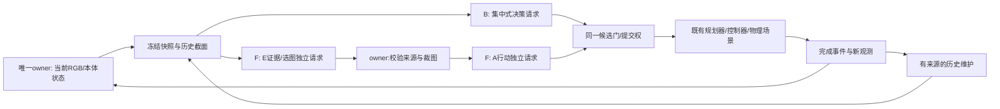

# B/F共同协议 v2（待实施）

所有“必须”是后续实现/验收要求，不代表本次已经运行。当前仅更新文档；机器配置 `execution_enabled=false`。

## 1. 调用与执行图

B在当前chunk完成后请求；F可在当前chunk执行时获取快照、串行运行E→A。图中的角色不是同时请求：一个现有模型worker槽位顺序处理所有角色；一个owner拥有物理/渲染和提交权。worker没有scene句柄、SDK/socket、执行工具。真实角色实例意味着独立schema、输入目录、request_id、role_id、预算记录与原始输出；两段同一个prompt不满足此定义。

## 2. 共同动作信封

外层 `full_pnp_candidate_v2`：

- `binding`：episode_id、request_id、source_observation_id/hash、source_step、captured_wall、task_revision、calibration_revision、action_interface_revision、history_cutoff/revision、parent_plan_id/hash、expected_join_id。
- `operation`：`chunk | observe | finish | stop`。chunk包含1–3个原动作；其它不夹带执行动作。
- `actions`：`move_pose`的7维有限数与单位四元数；`gripper`的opening∈[0,1]；`hold`的0<seconds≤2。保持现有合法域与控制器检查。第一版不开放 `move_delta`，避免将旧增量在新位置重复施加；模型仍可按当前观测生成绝对目标。
- `evidence_refs`：真正进入该请求的图/裁剪/历史证据ID。所有抓取/释放坐标注明对应当前或仍有效的证据；不以“已批准技能模板”替代坐标估计。
- `preconditions`：已声明且owner可核查的枚举谓词及允许误差，不允许自由文本绕过提交门。对象语义未知时不能伪装成可验证真值。
- `expected_join` / `expected_change`：单独标记PREDICTED，不能成为下一轮实测事件。
- `finish`携带 `verdict` 与新观测引用；`stop`随时撤销执行许可。简短理由用于审计，不要求或保存隐式思维链。

chunk不能跨越需要新结果判断的夹爪事件：gripper必须是chunk末动作；其后必须有真实新观测，才能批准依赖抓取/释放结果的下一个chunk。不能从一次视觉观测预先批准“闭合、假定持住、运输、释放、假定成功”的整条任务。稳定运输/退出可在证据充分时用1–3个合理动作，B/F规则完全相同。

空夹爪阶段不运行旧“必须已经持物”的placement gate；载荷/接触辅助按共同状态机启用，只能阻止不安全动作，不能直接告诉策略物体已抓住或目标坐标。这是完整任务适配，原M/S检查和阈值版本不被覆盖。

## 3. E与A的消息依赖

E输入：冻结快照的三路320×240缩略图、标定和原尺寸、合法历史投影、当前执行计划与预计接续点。原图保存在owner，E不能遍历日志。可选第四张历史关键帧也必须明确past时间戳。

E输出 `evidence_packet`：binding、claims(true/false/unknown、source=model_judgment、evidence_refs)、camera优先序、bbox归一化像素坐标/原图hash、遮挡或定位不确定性、需要再观察与否。没有动作执行字段。bbox只来源于本次输入的可见像素或带失效状态的在线跟踪；无GT投影、人工完美框、未来帧。裁图不创造原图没有的细节。

owner校验bbox边界/尺寸/来源后，从同一原图确定性裁剪并记录rectangle、resize、插值和新hash。A至少收到当前assembly全局图和一张当前细节全图，另有可选ROI与历史图，总附件≤4，符合既有infer接口。ROI不可用时回退三路当前全图，绝不能悄悄补正确框。E见过但A未实际附加的图片，只能作为E未验证声明来源，不能写成A亲见。A能请求再观察或拒绝E提案。

A输入包含E消息hash与原始来源ID、实际附件清单、历史截面、同一完整动作语义；输出共同动作信封。E/A无需同意才算正确；共同错误不会升级可信度。所有角色原始usage与等待都归F，不把E称为“免费预处理”。

只在E证据失效/初始/夹爪事件后强制新E调用；其它场合可复用来源未变且适用的E结果。复用记录 `cache_hit` 和原request_id；不得将旧产物改成新observation_id。若观测更新使依赖失效，丢弃待提交候选，按新cycle重新调度，计取消/重规划成本。

## 4. 观测与历史

共同可见输入：实际当前RGB、本体qpos/pad/flange状态、公开标定（K、相机位姿与坐标轴、tool/frame/单位）、实际执行状态和允许反馈。不能直接发送完整 `assembly_config.json`、`diagnostic_initial`、场景配置、object_pose、contact_latch、private_score、scene seed→正确坐标表、GT mask/bbox、未来轨迹/图像。原文件保存在独立私有证据区，input-only目录按白名单构建。

每份快照附每个图的相机、采集墙钟/step、原/派生hash、current/past/derived身份；跨三相机采集跨度也记录。当前与历史图不能混淆。相机外参变化是机器人几何测量，不是对象GT；camera selector只消费当时可用的内容。拿未来回放帧为旧提案背书禁止。

历史分三层，B/F共享原始追加日志：

1. `measured_transition`：owner在动作已完成或明确失败后插入一次，保存proposal、实发动作、before/after、实际状态、未执行余项、错误和图引用。controller_ok不等于grasp/place_ok。
2. `visual_hypothesis`：E/B/A对对象/持物/目标的判断，始终保留model_judgment/unknown、来源和年龄；不自动晋升实测物体事实。只有可独立检查的同类证据才能提高置信，不能靠反复复述。
3. `intent/prediction`：计划中的动作、预计接续与预期可见变化，永不进入完成历史。

B默认最近5条完成transition、最新未解决错误和最多一张最近动作前fixed图。F保留最多5条有用完整transition，以及最多8条对象/目标最后可见证据与未解决问题条目；采用确定性事件优先和来源引用，不新增摘要LLM。始终保留最新实发/实测、未知状态、任务/坐标/版本与未解决安全错误。超预算不截断半条/否定语义；保护字段无法容纳时记录overflow并保持/缩短普通历史，而不是删安全事实。F记忆容量是设计变量，后续替换时另做预算匹配，不冒称首个B/F已经隔离了“更聪明的记忆”效果。

owner更新实测revision；角色不得修改。每请求冻结一个history_cutoff，仅含在其采集/决策截止前完成的事件。父chunk尚未完成时可见的是executing，不是completed。被取消/丢弃提案记审计事件，不写成执行结果；失败未解决可持续保留，但不能把旧位置无限期当当前对象位置。

## 5. 候选提交与STOP

最多一条在途请求和一个未来候选；实际发送请求占共享额度，slot空闲且有需求才调用。F只能在已批准动作上前瞻，不能以候选指挥当前动作或提前开夹爪。

提交时owner读取真实当前本体状态并捕获接续观测，校验：完整schema/来源hash、不可变任务/接口/标定revision、同一父计划与接续点、父执行真实成功、位姿符合共享10mm/0.05rad原运动阈值、无STOP/超时/已消费，以及原路径/碰撞/持物等适用公共检查。source_observation保留原值；commit_observation单列，不能伪造旧观测为最新来通过legacy parser。

**对象相关前提还必须有效。** 机器人达到接续位姿本身不能证明对象没动。来自当时RGB的可见性/图像锚点一致性检查需同B/F可用、开发阶段冻结阈值；跟踪/遮挡无法证实时返回unknown，保持并重新观察/推理。禁止读GT object_pose决定旧候选可用。第一版对抓取后/释放后依赖结果的动作强制新cycle；异步可以提前收集/判断证据，不能凭预测跳过此屏障。若该保守规则使F实际重叠很少，照实报告，不为展示收益放宽。

目标任务变更、父动作失败、执行重规划替换parent_plan、关键可见性证据失效、位姿不符、晚到、schema错误：候选拒绝且只消费一次。因单调step正常前进不必机械使所有候选失效，但执行/任务/证据变化不能靠改revision掩盖。原move_delta不重放。

有效STOP在收到后的首个owner步边界终止，不等接续点。取消在途进程、清空候选，禁止新动作。若没有有效候选，两组按原drive targets保持并推进物理，计入墙钟与物理时间。安全/协议/API异常不自动请求“修复格式”；任务级合法失败可由新观测下的新显式提案重规划，须有父失败记录并占同一预算，不是隐藏重试。

`finish`首先关闭策略提交、取消所有待办，随后独立评分；分数只进入评分文件和最终报告，不回送角色继续尝试直到通过。结果判断和独立300步稳定窗口都在任务预算内；安全收尾若越界单列，不能算预算内成功。

## 6. 时间与成本账本

复用E1-B的单owner minimum-dt节奏：每步不得早于上一步完成墙钟+原dt=0.004s，不追赶、不缩放速度。B同步等待保持；F执行已批准动作；无候选均保持。同样的规划、渲染与日志规则，无法并行推进的render/规划停顿如实计入，不能仅给F慢速轨迹。

初始化墙钟/物理时间、Node/Codex预检、首请求cold start、完整任务墙钟/物理时间、动作/保持/观察/裁图/编码/角色等待/评分分别记录。初始化最多场景settle与不依赖物体/目标坐标的通用空手准备；观察目标后接近物体就是任务时间。先冻结起点再开始共同任务时钟，不能B计抓取而F预先抓好。

每个模型请求保留request_id/role/parent/dependency、actual command、snapshot/attachment/schema hash、raw/parsed、所有原始usage字段、起止/取消/超时/返回码。主机派发attempt与CLI进程启动数分别统计；上游未报告的身份/effort/内部重试为unknown。cached若为input子项不得重复相加，缺usage不记0；没有已核实计价不虚构金额。全部E/A、额外观察之后的推理、取消、晚到、失败和重规划纳入总成本。

同时记录RGB采集次数、相机帧数、渲染/编码时间、实际附件数和字节、所有裁剪/历史引用、物理动作数、初始化动作、保持、候选采用/丢弃原因及真实交集重叠。不能用理论请求减少或stub睡眠估算真实提速。

**授权与未来预算**：本轮真实请求0、硬件0，不继承旧任务的9请求建议。下一批先根据离线完整循环锁定共同 `T_episode`、`K_attempts`、新回合数及全部角色预算，再给用户确切总额。未锁定/未授权时执行开关关闭；不能给F单独延长预算。未来每请求必须≤min(已批准单请求上限,完整回合剩余时间)，所有角色共用计数器，不按“顶层一个A”隐藏E请求。当前机器卡的未来数值为null，不能解释为无限。
